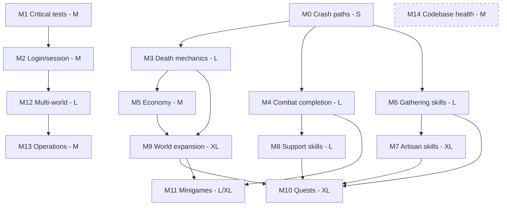

# RS Mod — Master Development Roadmap

_Generated 2026-07-23, based on [project_audit.md](project_audit.md). Target: a playable, mechanically-accurate OSRS emulation (rev 233)._

## How to read this document

- **Complexity** is estimated per milestone in T-shirt sizes:
  - **S** — days; single module, established patterns.
  - **M** — 1–2 weeks; a few modules, some research against the wiki/RSProx captures.
  - **L** — 3–6 weeks; new subsystem or many content modules.
  - **XL** — 2+ months; open-ended emulation research or very broad content surface.
- **Dependencies** list the milestones (M#) that must land first. Milestones with no mutual dependencies can proceed in parallel.
- Existing strengths this plan builds on: mature tick engine, coroutine scripting, event bus, type-safe cache reference system, complete combat formulas, BFS routefinder, SQLite persistence, rsprot networking. The framework is done; the work below is mostly *filling it in*.

---

## Phase 0 — Stabilization

### M0. Kill the crash paths — **Complexity: S** — _Dependencies: none_
Every runtime-throwing `TODO()` stub becomes a graceful path.
- [ ] `NpcModeProcessor` `OpPlayer6/7/8`, `ApPlayer6/7/8` — implement (delegate to AI event pattern used by modes 1–5) or no-op with a warning log.
- [ ] `PlayerCommons.kt` `): Boolean = TODO()` combat helper — implement.
- [ ] `WoodsmanTutor` level-99 "Mastery dialogue" — write the dialogue (wiki transcript).
- [ ] `GameServerCacheDownloader` zip-xtea branch — implement extraction or reject the URL form with a clear error.

### M1. Test the correctness-critical zero-coverage modules — **Complexity: M** — _Dependencies: none_
- [ ] `api/account` + `api/db` + `api/db-gateway`: round-trip save/load tests (characters, stats, inventories, varps), migration tests.
- [ ] `api/net`: login-flow unit tests (password, 2FA, bad credentials, CRC mismatch).
- [ ] Set a CI gate: new modules ship with tests.

### M2. Login/session completeness — **Complexity: M** — _Dependencies: M1 (net tests first)_
- [ ] Reconnection support (`ConnectionHandler.onReconnect`) — rsprot exposes the hooks; needs session-state retention policy.
- [ ] Token/JWS authentication (`tokenLogin`) — required by modern launchers.
- [ ] Decide email-login username policy (`AccountLoadResponseHook` TODO).

---

## Phase 1 — Core Gameplay Loop
_The "kill something, get loot, die, keep your 3 best items" loop. Everything downstream depends on this phase._

### M3. Death mechanics — **Complexity: L** — _Dependencies: M0_
- [ ] **NPC drop tables** (`NpcDeath.kt` TODO): drop-table type + DSL in `api/type` style, rare-table, tertiary drops, ironman loot rules. This is a *system*, not content — design it once, every NPC uses it.
- [ ] **Player death** (`PlayerDeath.kt` TODO): items-kept-on-death (3 + protect item), gravestone/death storage per rev-233 behavior, safe-area rules.
- [ ] Integration tests for both.

### M4. Combat completion — **Complexity: L** — _Dependencies: M0_
Close the ~20 `TODO(combat)` refinements:
- [ ] PvP: multiway logic, singles-plus, PK skulling, target death-flag varbit.
- [ ] Wilderness area checks + wilderness indicator (hunt processor).
- [ ] Vampyre/silver weapon modifiers; slayer-task attribute resolution.
- [ ] Recoils, retribution, item degradation on hit processors (player + npc).
- [ ] Single-target NPCs (barrows-style), "can attack" dialogue hooks.
- [ ] Missing worn bonuses: blowpipe darts, Dizana's quiver, ToA visual bonus.

### M5. Economy substrate — **Complexity: M** — _Dependencies: M3 (drops feed the economy)_
- [ ] Player-to-player trading (trade screen, dual-confirm, scam-proof swap via `objtx`).
- [ ] Shop restock behavior verification + world-shared shop stock.
- [ ] Bank PIN (banker dialogue TODO depends on it).
- [ ] Grand Exchange: content module over the existing `api/market` layer — interface, offer matching, collection box. _(GE alone is ~L; can split out.)_

---

## Phase 2 — Skills
_The framework pattern is proven (woodcutting). Each gathering skill is mostly config + scripts; artisan skills add interface work. Estimates assume the woodcutting template is followed._

### M6. Gathering skills — **Complexity: L** — _Dependencies: M0; M3 for skill-related drops_
- [ ] **Fishing** (module exists, empty) — spots, tools, catch tables.
- [ ] **Mining** — rocks, respawn timers, gem tables.
- [ ] **Woodcutting polish** — guild +7 boost, shared-tree +1 boost, axe behavior TODOs (canoe axe-charge degradation).
- [ ] **Hunter** — traps use loc/npc timers; hardest of the group.
- [ ] **Farming** — patch state machine + growth timers; borderline artisan; large varbit surface.

### M7. Artisan skills — **Complexity: XL** — _Dependencies: M6 (raw materials)_
- [ ] **Cooking** (module exists, empty) — burn rates, ranges.
- [ ] **Firemaking**, **Fletching**, **Crafting**, **Smithing** (smelting + anvil interface), **Herblore**, **Runecraft** (altars, essence, pouches), **Construction** (POH — by far the largest; instanced map regions — needs the region system exercised hard).

### M8. Support skills & training loops — **Complexity: L** — _Dependencies: M4_
- [ ] **Prayer** — training (bones/altars) + full prayer effect coverage in combat (drain rates exist in formulas; verify all overheads/offensive prayers).
- [ ] **Agility** — courses, shortcuts (routefinder interaction), stamina/run energy integration.
- [ ] **Thieving** — pickpocket, stalls, stun mechanics.
- [ ] **Slayer** — task system, masters, points, slayer-only monsters (depends on M3 drop tables + M4 slayer attributes).
- [ ] **Magic non-combat** — teleports, enchanting, alchemy (spellbook framework exists in `api/spells`).

---

## Phase 3 — World
### M9. World expansion — **Complexity: XL (incremental, parallelizable)** — _Dependencies: M3, M5; per-city content gated by relevant skills_
- [ ] Cities: Varrock, Falador, Draynor, Al Kharid, Edgeville, Port Sarim… (Lumbridge is the template: ~11 NPC scripts + area script per city).
- [ ] Transport network: ships, gnome gliders, spirit trees, canoe polish, home teleports.
- [ ] Generic NPC coverage: remaining banker variants (PIN/UIM dialogues), shopkeepers, guards, quest-adjacent NPCs.
- [ ] Music: real MIDI type loading (engine TODO), region unlock coverage, emulation timing TODOs.

### M10. Quests — **Complexity: XL (incremental)** — _Dependencies: M9 (locations), M6–M8 (skill gates)_
- [ ] Quest framework first: quest log/journal wiring, varbit-driven stage tracking, quest-point registry, per-quest completion scroll. (**M** on its own.)
- [ ] Then F2P quest set (Cook's Assistant → Dragon Slayer) — each quest is S–M; unblock the TODO-noted hooks (Cold War cow states, Hatius achievement diary, Donie quest dialogue).
- [ ] Achievement diaries (framework + Lumbridge diary; overlay TODO already noted).

### M11. Minigames & instancing — **Complexity: L–XL** — _Dependencies: M9; region/instance system validation_
- [ ] Validate the region-instancing quirks documented in `docs/quirks.md` (zone-copy edge cases) under real load.
- [ ] Starter set: Castle Wars or Pest Control (multiplayer), Barrows (single-player, depends on M4 single-target NPC work + M3 drop tables).

---

## Phase 4 — Scale & Production
### M12. Multi-world / infrastructure hardening — **Complexity: L** — _Dependencies: M2_
- [ ] World list + world switching (realm/world tables already in schema V1).
- [ ] Evaluate SQLite → PostgreSQL migration for multi-world deployments (Flyway makes this tractable; `db-gateway` abstraction already isolates JDBC).
- [ ] Friends/ignore lists, private messaging, clan chat (rsprot supports the packets; no server implementation yet).
- [ ] World-entity support in `api/net` (currently a bare provider) — needed for ships/POH rendering on modern revs.

### M13. Operations — **Complexity: M** — _Dependencies: M12_
- [ ] Moderation tooling on top of `api/cheat` + mod_group columns: mute/ban/kick, in-game commands, audit log.
- [ ] Metrics/observability: tick-duration histogram (overdue detection exists — export it), player counts, save-failure alerting (`AccountRegistry` emergency-backup TODO).
- [ ] Load testing: headless bot clients driving login + walking + combat; verify single-thread tick budget at target population; profile with the existing JMH baselines.
- [ ] Backup/restore runbook for the SQLite (or PG) store.

### M14. Codebase health (continuous, schedulable anytime) — **Complexity: M**
- [ ] Consolidate `api/combat-accuracy`/`combat-maxhit` vs `combat-formulas` overlap; dedupe `combat-commons` npc/player extension copies.
- [ ] Codegen or KSP for the `api/type` References/Resolver/Builder/Editor quadruplets.
- [ ] Remove checked-in `server/services/build/` output; add to `.gitignore`.
- [ ] Grow `engine/game` test coverage (currently 14 test files / 274 source files).
- [ ] Resolve `docs/quirks.md` TODO list into real documentation; per-module READMEs in `api/`.

---

## Dependency graph

## Suggested execution order

| Wave | Milestones | Rationale |
|---|---|---|
| 1 | M0, M1 (parallel) | Cheap, de-risks everything. |
| 2 | M2, M3, M4 (parallel) | Session + the core loop; combat and death don't collide. |
| 3 | M5, M6, M8 | Economy and first skill batch. |
| 4 | M7, M9 (start), M12 | Artisan skills; begin city-by-city expansion; infra in parallel. |
| 5 | M10, M11, M13 | Quests/minigames once world + skills exist; ops before public launch. |
| — | M14 | Continuous; slot into any wave. |

## Estimation caveats

- Emulation-accuracy work (anything tagged `TODO(emulation)` or requiring RSProx packet captures) is research-bound: verifying official behavior often dwarfs implementation time.
- Content milestones (M9, M10) are open-ended by nature — sized here for a first meaningful tranche (F2P surface), not exhaustive OSRS parity.
- Construction (in M7) and Grand Exchange (in M5) are each large enough to promote to standalone milestones if staffing allows.
